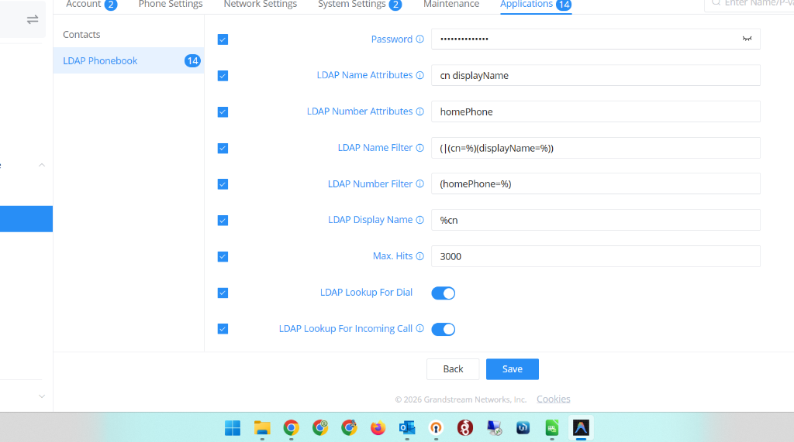
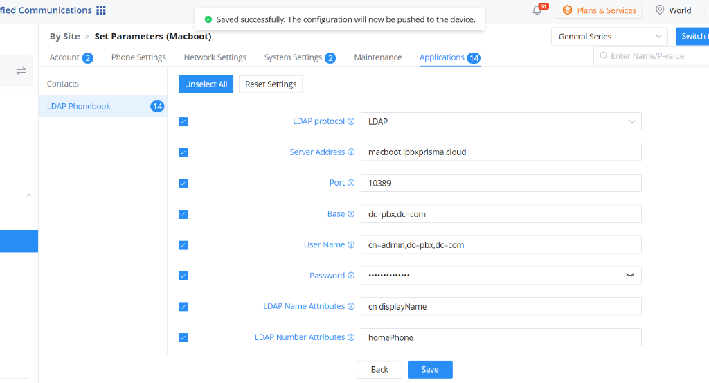

# Guia de Configuração LDAP - Grandstream (GXP / GRP / GDMS) 📖

Este manual orienta a configuração do **Servidor LDAP de Ramais e Agenda** nos telefones IP e Gateways da **Grandstream** (séries GXP16xx, GXP21xx, GRP26xx e plataforma em nuvem GDMS).

---

## 📸 Imagens de Referência da Configuração

### 1. Parâmetros de Conexão e Autenticação


### 2. Filtros de Busca e Identificação de Chamadas


---

## ⚙️ Parâmetros de Configuração Manual (Web Interface)

- **LDAP Server:** `macboot.ipbxprisma.cloud`
- **Port:** `10389`
- **Base DN:** `dc=pbx,dc=com`
- **Username:** `cn=admin,dc=pbx,dc=com`
- **Password:** `SUA_SENHA_AQUI` (definida em `/etc/sysconfig/issabel-ldap`, padrão: `issabelPBX`)
- **LDAP Name Filter:** `(|(cn=%)(displayName=%))`
- **LDAP Number Filter:** `(homePhone=%)`
- **LDAP Name Attributes:** `cn displayName`
- **LDAP Number Attributes:** `homePhone`
- **LDAP Display Name:** `%cn`
- **Lookup Display Name:** `%cn`
- **Max Hits:** `3000`
- **Search Timeout:** `30`
- **LDAP Lookup:** Habilitar para Incoming e Outgoing Calls

---

## 📋 Tabela Detalhada de Parâmetros

| Campo / Parâmetro | Valor Recomendado | Descrição / Observação |
| :--- | :--- | :--- |
| **LDAP protocol** | `LDAP` | Protocolo padrão de comunicação. |
| **Server Address** | `macboot.ipbxprisma.cloud` *(ou IP do PBX)* | Endereço FQDN/Domínio ou IP do seu servidor Issabel. |
| **Port** | `10389` | Porta padrão do serviço `issabel-ldap`. |
| **Base** | `dc=pbx,dc=com` | Base DN padrão de consulta. |
| **User Name** | `cn=admin,dc=pbx,dc=com` | Usuário administrador padrão configurado no serviço. |
| **Password** | *Sua Senha* | Senha definida em `/etc/sysconfig/issabel-ldap` (padrão: `issabelPBX`). |
| **LDAP Name Attributes** | `cn displayName` | Atributos utilizados para exibir o nome do contato. |
| **LDAP Number Attributes** | `homePhone` *(apenas ramais)* <br> **OU** <br> `homePhone telephoneNumber mobile` *(ramais + agenda)* | `homePhone`: número do ramal interno. <br> `telephoneNumber`/`mobile`: contatos externos da Agenda. |
| **LDAP Name Filter** | `(\|(cn=%)(displayName=%))` | Filtro aplicado ao pesquisar contatos por nome. |
| **LDAP Number Filter** | `(homePhone=%)` *(apenas ramais)* <br> **OU** <br> `(\|(homePhone=%)(telephoneNumber=%)(mobile=%))` | Filtro aplicado ao pesquisar por dígitos numéricos. |
| **LDAP Display Name** | `%cn` ou `%displayName` | Formato como o nome será exibido na tela do aparelho. |
| **Max. Hits** | `3000` *(ou 1000)* | Limite máximo de contatos retornados na consulta. |
| **Search Timeout** | `30` | Tempo limite de espera da busca em segundos. |
| **LDAP Lookup For Dial** | `Ativado (Yes)` | Busca automática ao digitar no teclado para discar. |
| **LDAP Lookup For Incoming Call** | `Ativado (Yes)` | Identifica e mostra o nome do contato nas chamadas recebidas (Bina inteligente). |

---

## 🛠️ Template XML de Provisionamento LDAP Grandstream

Você pode baixar o arquivo XML pronto para uso ou importá-lo diretamente no seu aparelho / GDMS:

- 📥 **Arquivo para Download:** [`docs/templates/ldap_grandstream.xml`](./templates/ldap_grandstream.xml)
- 🌐 **Link Direto (RAW):** `https://raw.githubusercontent.com/LeandroSaltori/ipbx-issabel6.0/main/docs/templates/ldap_grandstream.xml`

### Conteúdo do Arquivo `ldap_grandstream.xml`:

```xml
<?xml version="1.0" encoding="utf-8"?>
<gs_provision>
    <config version="2">
        <item name="ldap">
            <part name="server">macboot.ipbxprisma.cloud</part>
            <part name="port">10389</part>
            <part name="base">dc=pbx,dc=com</part>
            <part name="protocol">LDAP</part>
            <part name="version">3</part>
            <part name="username">cn=admin,dc=pbx,dc=com</part>
            <part name="password">COLOQUE_A_SENHA_AQUI</part>
            <part name="ldapDisplayName">%cn</part>
            <part name="ldapNumberFilter">(homePhone=%)</part>
            <part name="ldapNumberAttributes">homePhone</part>
            <part name="ldapNameFilter">(|(cn=%)(displayName=%))</part>
            <part name="ldapNameAttributes">cn displayName</part>
            <part name="ldapMailFilter"></part>
            <part name="ldapMailAttributes"></part>
            <part name="ldapPositionFilter"></part>
            <part name="ldapPositionAttributes"></part>
            <part name="ldapDepartmentFilter"></part>
            <part name="ldapDepartmentAttributes"></part>
        </item>
    </config>
</gs_provision>
```

---

## 📥 Como Importar o XML no Aparelho ou na Nuvem

### Opção 1: Via Interface Web Local do Telefone Grandstream
1. Acesse o IP do telefone no navegador e faça login (padrão: `admin`).
2. Vá em **Maintenance** ➔ **Upgrade and Provisioning** ➔ **Config File**.
3. No campo **Upload Configuration File**, selecione o arquivo [`ldap_grandstream.xml`](./templates/ldap_grandstream.xml).
4. Clique em **Upload XML Config**.
5. O telefone aplicará as configurações instantaneamente sem necessidade de reiniciar.

---

### Opção 2: Via Plataforma em Nuvem GDMS (Grandstream Cloud)
1. Acesse o portal [GDMS](https://www.gdms.cloud/).
2. Vá em **Device Configuration** ➔ **Configuration Templates**.
3. Selecione o modelo do aparelho (ex: `GRP2601`, `GRP2612`, etc.) ou crie um modelo global de Conta/Parâmetros.
4. Na aba **Contacts / Phonebook** ➔ **LDAP**, preencha os parâmetros do XML ou importe o template.
5. Associe aos aparelhos dos clientes e clique em **Save & Push**. Todos os telefones da empresa receberão a agenda corporativa e os ramais automaticamente!

---

## 💡 Dicas de Otimização

1. **Apenas Ramais Internos:**
   - Mantenha `LDAP Number Attributes = homePhone` e `LDAP Number Filter = (homePhone=%)`.
2. **Ramais + Contatos da Agenda Telefônica (Clientes/Fornecedores):**
   - Configure `LDAP Number Attributes = homePhone telephoneNumber mobile` e `LDAP Number Filter = (|(homePhone=%)(telephoneNumber=%)(mobile=%))`.
3. **Consulta Direta no Aparelho:**
   - No teclado do Grandstream, basta pressionar o botão **Contacts / Phonebook** e selecionar **LDAP** para navegar por todos os ramais da empresa em tempo real.
